# HN Hiring Scanner

Quickly research **HN "Who's hiring?"** job postings with advanced filtering and side-by-side comparision.


## Features

- Sort/filter by company, location, remote policy, job title, visa sponsorship, ...
- Tech-stack filter with boolean logic support (eg. `Python AND (React OR Angular)`, `C AND NOT C++`)
- Side-by-side job comparison tool with differences/commons highlighted.

```mermaid
flowchart BT
    %% Professional Pastel Color Scheme
    classDef user fill:#FFDFFF,stroke:#AFFBF,stroke-width:4px,color:#333
    classDef action fill:#DFFFEF,stroke:#4F7F3F,stroke-width:2px,color:#333
    classDef benefit fill:#EFFFEF,stroke:#4F9F7F,stroke-width:2px,color:#333
    classDef outcome fill:#FFFFCF,stroke:#FFDF3F,stroke-width:4px,color:#333
    classDef system fill:#CFEFFF,stroke:#4F7FFF,stroke-width:2px,color:#666

    %% Job Seeker Journey (Primary Focus)
    JobSeeker(("👤 **Job Seeker**<br/>Looking for Opportunities")):::user

    subgraph Journey [" Your Job Search Journey "]
        direction BT
        Search["🔍 **Search & Filter**<br/>Find Relevant Positions"]:::action
        Compare["⚖️ **Compare Opportunities**<br/>Side-by-side Analysis"]:::action
        Shortlist["⭐ **Shortlist Best Matches**<br/>Track Favorites"]:::action
        Apply["📧 **Apply Directly**<br/>Contact Employers"]:::action
    end

    Hired{{"🎉 **HIRED!**<br/>Land Your Dream Job"}}:::outcome

    %% Supporting System (Secondary)
    subgraph System [" Behind the Scenes "]
        direction BT
        Source["📰 Hacker News"]:::system
        Pipeline["🛠️ HN Hiring<br/>Scanner Pipeline"]:::system
        DB[("💾 Structured<br/>Job Database")]:::system
        Source -->|Monthly| Pipeline
        Pipeline -->|Populates| DB
    end

    %% Primary User Flow (Bold arrows)
    JobSeeker ==>|1. Visit Platform| Search
    Search ==>|2. Discover| Compare
    Compare ==>|3. Evaluate| Shortlist
    Shortlist ==>|4. Take Action| Apply
    Apply ==>|5. Interview Process| Hired

    %% System Support (Dotted arrows)
    DB -.->|Powers| Search
```



## Setup

```bash
cd front-end         # Navigate to front-end directory
make install_deps    # Install dependencies
make dev             # Start dev server (port 4200)
make build           # Build for production. Output: `dist/hn-hiring-frontend/browser/`
```

See `front-end/Makefile` for all commands.


## Local Development

1. **Navigate to front-end directory**
   ```bash
   cd front-end
   ```

2. **Install dependencies**
   ```bash
   make install
   ```

3. **Start dev server**
   ```bash
   make dev
   ```
   Opens at `http://localhost:4200` with hot reload

4. **View locally**
   - Navigate to `http://localhost:4200`
   - App loads sample data from `public/jobs.json`
   - Make changes in `src/` - auto-reloads

5. **Debug**
   - Open browser DevTools (F12)
   - Source maps enabled for debugging TypeScript
   - Angular DevTools extension recommended
